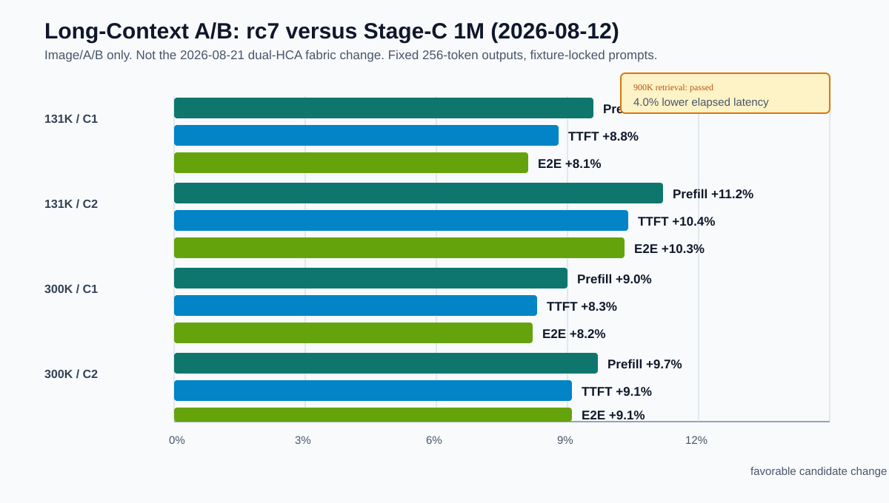
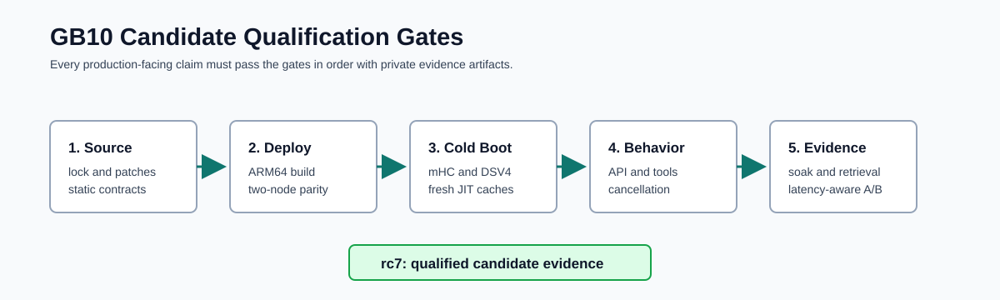

# DeepSeek V4 Flash GB10 Runtime

An independently maintained, private-ready serving recipe for
`deepseek-ai/DeepSeek-V4-Flash-0731` on a two-node NVIDIA DGX Spark GB10
cluster. It builds a pinned vLLM runtime, applies focused SM121/DSpark
corrections, provides an operator-safe cluster control plane, and records a
reproducible qualification protocol.

<p align="center">
  
</p>

## Current Result

The active release candidate is `dspark-vllm-gb10:v0.27.1-gb10-rc7`:

- vLLM `v0.27.1` pinned to commit `6e448d0ea9bf3d88d898b65449ca6dc2aec170ac`
- CUDA 13.0.3, Torch 2.13.0, FlashInfer 0.6.16.post3
- TP=2, DSpark K=5, DeepGEMM MXFP4 experts, `fp8_ds_mla` KV cache
- 1,048,576 max context, 6 sequences, 8,192 batched tokens, 0.84 GPU memory
  utilization
- Native FlashInfer DSV4 top-k 192/256 dispatch for the DSpark sparse-MLA
  shape on GB10
- Focused DeepGEMM router-counter warmup that prevents the prior under-load
  Triton JIT event

On the controlled 1M baseline comparison, rc7 passed identical 900K
three-needle retrieval and improved long-context prefill, TTFT, and
end-to-end latency by approximately 8-11% at 131K and 300K prompts.

<p align="center">
  
</p>

**2026-08-14 campaign (live now):** `#31` CPU hook skipped, thinking default
off, suppress-stops 0.27.1 rewrite on, 1M advertised. Exact 32k×6 on a fresh
1M bounce: **46.36 / 46.38 / 48.48 tok/s**, 1.05× spread, MTP 95.1%. Repeat
**42.59 / 43.89 / 45.31**. Exact 128k C1: **99.91 tok/s**, MTP 95.6%. Exact
32k C1: **103.45 tok/s**, MTP 96.4%. Exact 256 C1: **109.77 tok/s**, MTP 97.3%.
Phase 5 11/11, encoding 4/4, 1k soak 1000/1000, 1.04M retrieval PASS. Ledger:
[docs/CAMPAIGN_2026-08-14.md](docs/CAMPAIGN_2026-08-14.md). Machine state:
[`project-status.json`](project-status.json).

The 2026-08-12 build/A/B history remains in
[the GB10 handoff](docs/GB10_DSV4_HANDOFF_2026-08-12.md).

## Design Principles

| Principle | How this repository applies it |
|---|---|
| Reproducibility | Exact sources and dependency/research references are in [`runtime/upstream.lock`](runtime/upstream.lock); the ordered vLLM series is checked before application. |
| Narrow customization | Carry focused hardware/model fixes, not a wholesale unpublished runtime fork. FlashInfer is overlaid only with the exact upstream DSV4 dispatch delta required by DSpark. |
| Operator safety | `vllm-switch` validates both ranks before activation, records the active profile, captures failure state, and rolls back to the previously active comparable profile. |
| Evidence over claims | Cold-cache startup, API contracts, soak, retrieval, and fixture-locked latency-aware A/B are all part of qualification. |
| Privacy by default | Node topology, credentials, raw prompts, logs, artifact paths, and operational history remain under ignored `.private/` storage. |

## Supported Runtime Contract

This is a text-serving lane for DeepSeek V4 Flash 0731 on paired GB10 nodes.
It uses `fp8_ds_mla` for DeepSeek V4 sparse MLA KV cache.

`nvfp4_ds_mla` must not be presented as native packed NVFP4 support. Previous
runtime paths used that spelling as an alias for an FP8-style record and kernel
path. A real DeepSeek V4 packed NVFP4 cache requires a separate 448+64 record,
writer, SM121 sparse readers, DSpark/hybrid-cache support, and quality gates.
See [NVFP4 DS-MLA status](docs/NVFP4_DS_MLA.md).

## Documentation

| Document | Use it for |
|---|---|
| [GB10 handoff](docs/GB10_DSV4_HANDOFF_2026-08-12.md) | Full implementation history, configuration, results, caveats, and next-agent plan. |
| [Runtime contract](docs/RUNTIME_V0271_GB10.md) | Pinned inputs, build rules, patch policy, and serving contract. |
| [Control plane](docs/CLUSTER_CONTROL_PLANE.md) | Deployment boundaries, `vllm-switch`, validation, and rollback behavior. |
| [Upstream audit](docs/UPSTREAM_AUDIT_2026-08-11.md) | Why each upstream/downstream change was selected or deferred. |
| [NVFP4 DS-MLA](docs/NVFP4_DS_MLA.md) | Current FP8 decision and requirements for true packed NVFP4 research. |
| [Documentation guide](docs/README.md) | Current documents versus retained historical references. |
| [Credits](CREDITS.md) | Attribution and license lineage for upstream foundations. |

## Build and Operate

Prepare and verify the exact patched source locally:

```bash
runtime/scripts/prepare-source.sh
```

Build only through the guarded helper. It verifies source inputs and protects
the cluster service lifecycle:

```bash
./build-dspark-vllm-runtime.sh
```

On the configured cluster, stage and install control-plane changes separately,
then validate before any maintenance-window activation:

```bash
./cluster/deploy-to-sparks.sh --apply
./cluster/install-control-plane.sh --install
vllm-switch validate deepseek-v4-flash-0731-v0271-canary
vllm-switch status
```

`deploy-to-sparks.sh --apply`, control-plane installation, validation, and
profile activation have intentionally separate responsibilities. Read the
[control-plane guide](docs/CLUSTER_CONTROL_PLANE.md) before switching a live
model. Keep actual host values in the deployed, ignored environment file; do
not commit them.

## Qualification

The qualification suite checks completion, streaming, reasoning modes,
structured output, tool replay, cancellation recovery, concurrent smoke,
context ladders, soak stability, retrieval, and performance smoke:

```bash
OUTPUT_ROOT="$PWD/.private/qualification" \
  cluster/scripts/run-qualification.sh --run \
  --label rc-next --model deepseek-v4-flash-0731-v0271-canary --mode full
```

For release comparisons, use [`scripts/ab-matrix-0731.py`](scripts/ab-matrix-0731.py)
and [`scripts/compare-ab-matrix.py`](scripts/compare-ab-matrix.py). They lock
prompt fixtures and report TTFT, end-to-end latency, decode latency, prefill,
and output throughput. Do not compare mismatched fixtures, completion limits,
trial counts, temperatures, or prefix-cache behavior.

<p align="center">
  
</p>

## Repository Layout

```text
runtime/                 Pinned vLLM source preparation, Docker build, patch series
cluster/                 Two-node deployment, profiles, vllm-switch, qualification runner
scripts/                 API, retrieval, benchmark, and fixture-locked A/B tools
docs/                    Runtime contract, audit, handoff, operational documentation
docs/assets/             Local SVG architecture, evidence, and qualification diagrams
```

## Attribution and Licensing

This repository is an independent project, not a GitHub fork. It retains
clear provenance and licenses for vLLM, FlashInfer, DeepGEMM, DSpark, NVIDIA
components, and prior public research. The project-specific credit and license
notes are in [CREDITS.md](CREDITS.md); downstream source files retain their
original license headers.

## Status and Next Work

The completed runtime is usable as the current validated candidate. The next
engineering work is intentionally limited: explain the observed cache-pool
capacity difference, optionally warm three remaining speculative helper
kernels based on actual JIT keys, extend full-profile soak coverage, and add
DSpark acceptance/cache telemetry to the A/B harness. True packed NVFP4
DS-MLA remains a separate research implementation.
