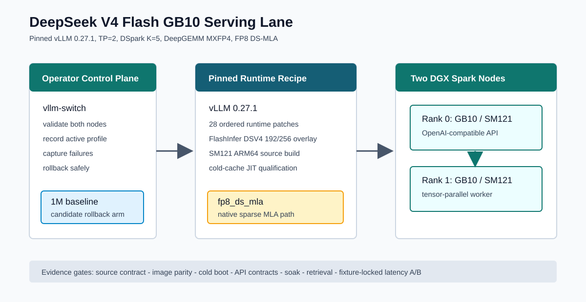
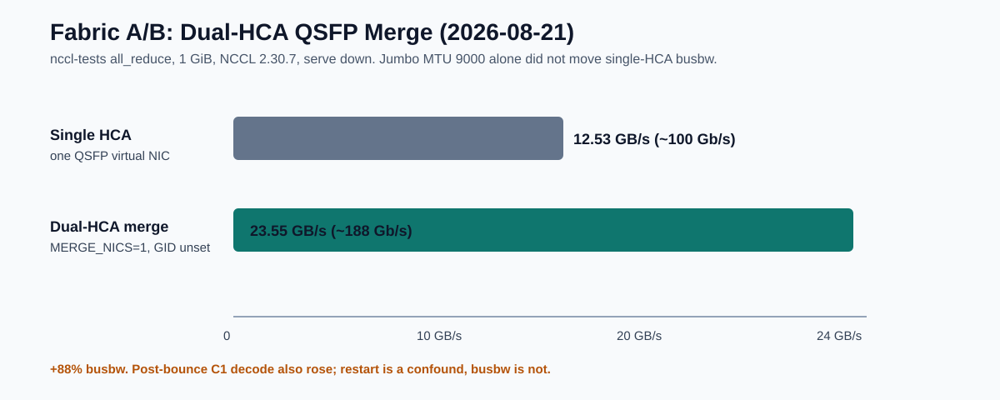

# DeepSeek-V4-Flash-0731 on 2× DGX Spark (GB10)

A public, independently maintained serving recipe for
[`deepseek-ai/DeepSeek-V4-Flash-0731`](https://huggingface.co/deepseek-ai/DeepSeek-V4-Flash-0731)
on a two-node NVIDIA DGX Spark / GB10 cluster.

This is **not** stock vLLM, and it is **not** a claim that `nvfp4_ds_mla` is
packed NVFP4. It is the runtime we actually serve: pinned vLLM **0.27.1**,
DSpark **k=5**, `fp8_ds_mla` KV, official **1M** context, server default
**thinking=max**, dual-HCA QSFP merge.

<p align="center">
  
</p>

**Humans:** this README. **LLMs:** ingest [`LLM_README.md`](LLM_README.md) first.
Live knobs are also in [`project-status.json`](project-status.json).

---

## Why this repo exists

Stock vLLM on GB10/SM121 can load DeepSeek V4 Flash weights and still die after
that (DeepGEMM scale-factors → CUTLASS `scaled_mm`). Community images that spell
the cache `nvfp4_ds_mla` are usually an **FP8-record alias**, not a packed NVFP4
implementation.

We wanted a recipe another operator — or another LLM — can read and reproduce:

1. **What** we serve (image, flags, hotfixes).
2. **Why** each knob exists (the failure it closed).
3. **What we measured** (protocol-tagged; do not mix think-off C1 with thinking=max eval).

Credits for upstream work we built on: [CREDITS.md](CREDITS.md).

---

## Validated contract (live 2026-08-21)

Copied from a running two-node serve (`docker inspect` `Config.Cmd`, not leftover env files).

- **Image:** `dspark-vllm-gb10:v0.27.1-gb10-rc7`
- **Checkpoint:** `deepseek-ai/DeepSeek-V4-Flash-0731` @ `9e165c30e2704aec5d9d593cce3eebd58bbef1cb`
- **API ids:** `deepseek-ai/DeepSeek-V4-Flash-0731` and `deepseek-v4-flash-0731`
- **Topology:** TP=2, MP backend, worker-first, no Ray
- **Envelope:** `max_model_len=1048576` · `max_num_seqs=6` · `max_num_batched_tokens=8192` · GMU `0.84`
- **Spec:** DSpark `k=5` (never 7)
- **KV:** `fp8_ds_mla` · `--kv-cache-memory 28235618304` (26.3 GiB → **2.74M tokens, 2.61× @1M**)
- **MoE:** `deep_gemm`
- **Prefill:** `--long-prefill-token-threshold 1024`
- **Thinking:** server default `max` via the [Mia #48](https://github.com/MiaAI-Lab/DeepSeek-v4-Flash-DSpark-2x-DGX-Spark) GPU closer. Do **not** set `DEFAULT_THINKING_TOKEN_BUDGET`. Clients that must not think send `chat_template_kwargs.thinking=false`.
- **#31 CPU host-scan:** skipped (`DSPARK_SKIP_ISSUE31_HOTFIX=1`) — ~1.8× decode tax at 32k×6
- **Hotfixes ON:** suppress-stops (0.27.1 rewrite), Mia #48 GPU closer, #55 tool-truncation, #52492 indexer capture guard, GB10 `busy_loop` 2 ms, `reasoning_effort=xhigh`→`max`
- **Fabric:** both QSFP virtual HCAs listed, `NCCL_IB_MERGE_NICS=1`, `NCCL_IB_GID_INDEX` **unset**, jumbo 9000. GLOO/TP stay on a single ifname.

Canonical env template:
[`cluster/environments/deepseek-v4-flash-0731-v0271-canary.env.example`](cluster/environments/deepseek-v4-flash-0731-v0271-canary.env.example).

<p align="center">
  
</p>

---

## What we found

Numbers are protocol-tagged on purpose. Mixing them is how this cluster lies to you.

**Correctness (2026-08-14, rc7 Arm B + 1M, think-off decode protocol)**

- 1.04M three-needle retrieval PASS (20.7 min)
- Phase 5 11/11, encoding 4/4, 3× restart greedy identical, 1k soak 1000/1000
- Exact 32k×6: **46.4 tok/s** median with the #31 CPU hook **off** vs **24.5** with it on
- Exact-ceiling prompts (`max_model_len` + 2 after template) **400** — stay ~8k under 1,048,576

**Fabric (2026-08-21, isolated nccl-tests, serve down)**

- 1 GiB all_reduce busbw **12.53 → 23.55 GB/s** once both QSFP virtual HCAs are merged
- Jumbo 9000 alone on one HCA does almost nothing (12.53 → 12.59)
- A single `NCCL_IB_GID_INDEX` pin is wrong: IPv4 RoCEv2 indexes disagree across the two members

**Think-off decode after dual-HCA bounce (ignore_eos; not the 08-14 exact-length ladder)**

- 256 C1: **77.4 tok/s**, TTFT 201 ms
- 32k×6: **47.5 tok/s**, spread 1.00×

**Thinking=max quality (2026-08-21 official full-compare + Grok-4.5 judge)**

- Q **0.693** · tools 1.00 · coding **0.875** · Grok **4.667 / 15**
- vs 2026-08-19 thinking=max official: Q **0.583** / coding **0.125**
- Do **not** compare that Q to think-off spark-eval (~0.92). Thinking=max burns time in reasoning; coding hang-guards are a floor, not a flatten.

<p align="center">
  
</p>

Full decision log: [PROJECT-DECISIONS.md](PROJECT-DECISIONS.md).
Campaign ledger: [docs/CAMPAIGN_2026-08-14.md](docs/CAMPAIGN_2026-08-14.md).

---

## Quick start

You need two GB10 nodes, a working RoCE/NCCL path, Docker + Compose on both,
and the same 0731 checkpoint on both. Fill **your** fabric addresses in an
untracked env file. Do not commit them.

```bash
git clone https://github.com/nepenth/deepseek-v4-flash-gb10.git
cd deepseek-v4-flash-gb10

# 1. Operator env (canonical knobs; host values stay local)
cp cluster/environments/deepseek-v4-flash-0731-v0271-canary.env.example \
   cluster/environments/deepseek-v4-flash-0731-v0271-canary.env
# also used by the compose launcher:
cp .env.dspark.example .env.dspark
# edit WORKER_HOST, MASTER_ADDR, NCCL_IB_HCA, NCCL_SOCKET_IFNAME, VLLM_HOST_IP, …

# 2. Weights on both nodes (forces hub online for the pull, then serve offline)
./prepare-dspark-model-cache.sh --official --yes

# 3. Optional: build the pinned runtime if you do not already have the image
./build-dspark-vllm-runtime.sh

# 4. Start worker first, then head
./start-deepseek-v4-flash-dspark.sh

# 5. Prove it
curl -fsS http://127.0.0.1:8000/v1/models
./smoke-deepseek-v4-flash-dspark.sh
./status-deepseek-v4-flash-dspark.sh
```

Expect `max_model_len=1048576` and both served names. Boot log (trust live numbers):

```text
Available KV cache memory: 26.3 GiB
GPU KV cache size: 2,740,813 tokens
Maximum concurrency for 1,048,576 tokens per request: 2.61x
```

Prove argv from `docker inspect … Config.Cmd` (interpolated `--max-model-len`).
Container `Env` and leftover profile files are not the serve.

Same-profile `vllm-switch` does **not** recreate for env-only changes — force-remove
both rank containers. Longer operator path: [docs/SETUP.md](docs/SETUP.md).

---

## Do not

- Use stock vLLM 0.27.x / a generic GB10 canary as a DS4 path
- Spell the cache `nvfp4_ds_mla` and call it packed NVFP4 — see [docs/NVFP4_DS_MLA.md](docs/NVFP4_DS_MLA.md)
- Set DSpark **k=7**
- Set `VLLM_USE_V2_MODEL_RUNNER=0`
- Turn thinking=max on with `DEFAULT_THINKING_TOKEN_BUDGET` (that is the #39 cliff)
- Enable the #31 CPU host-scan hook on a seqs=6 serve
- Pin one `NCCL_IB_GID_INDEX` on dual-HCA
- Cut `max_model_len` to free RAM — shrink `KV_CACHE_MEMORY`
- Raise GMU above 0.84
- Bake patch `0029` without an A/B against this winner (it is in-tree, out of `series`)
- Compare thinking=max spark-eval Q to think-off Q, or `decode-bench.py` 32k×6 to exact issue27

Rejected paths (do not resurrect without new evidence): [PROJECT-DECISIONS.md](PROJECT-DECISIONS.md).

---

## Layout

```text
cluster/environments/*.env.example   canonical serving knobs (no host values)
docker-compose.dspark.yml            TP=2 MP launch + hotfix bind-mounts
start-deepseek-v4-flash-dspark.sh    worker-first launcher; scp's every hotfix
patches/                             runtime bind-mount hotfixes (no image rebuild)
runtime/                             pinned vLLM 0.27.1 source, patch series, image build
docs/                                contracts, campaign, NVFP4 status, setup
LLM_README.md                        LLM ingest: contract, pitfalls, file map
```

Optional vision sidecar / MCP installer is **not** the validated text-serving
path. Leave `ENABLE_VL_SIDECAR=0`.

---

## Docs

- [LLM ingest](LLM_README.md) — start here if you are a model
- [Serving contract](docs/DEEPSEEK_V4_FLASH_0731.md)
- [Decisions / rejected paths](PROJECT-DECISIONS.md)
- [2026-08-21 dual-HCA](notes/2026-08-21-dual-hca.md)
- [2026-08-21 thinking=max eval](notes/2026-08-21-thinkmax-eval.md)
- [2026-08-14 campaign](docs/CAMPAIGN_2026-08-14.md)
- [Runtime / patch policy](docs/RUNTIME_V0271_GB10.md)
- [Setup](docs/SETUP.md)
- [NVFP4 DS-MLA](docs/NVFP4_DS_MLA.md)
- [Documentation index](docs/README.md)
- [Credits](CREDITS.md)

---

## Status

The live winner is still `dspark-vllm-gb10:v0.27.1-gb10-rc7` at advertised 1M
with dual-HCA merge and thinking=max. Next engineering work is intentionally
small: A/B patch 0029 against this winner before any rebuild. Packed NVFP4
DS-MLA remains a separate research implementation.

This repository does not embed cluster hostnames, RFC1918 addresses, local DNS,
or operator usernames. Put those in the untracked env file.
